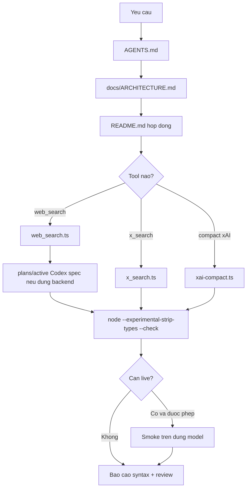
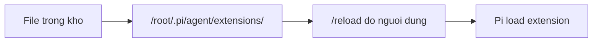
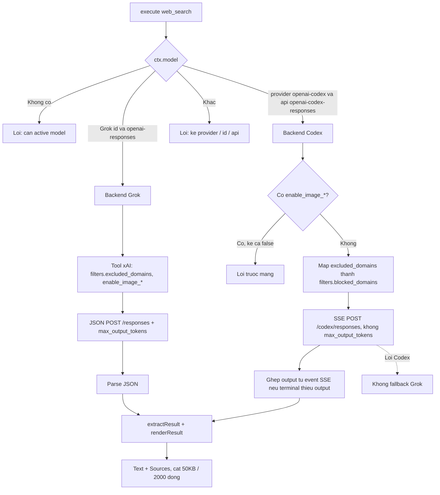
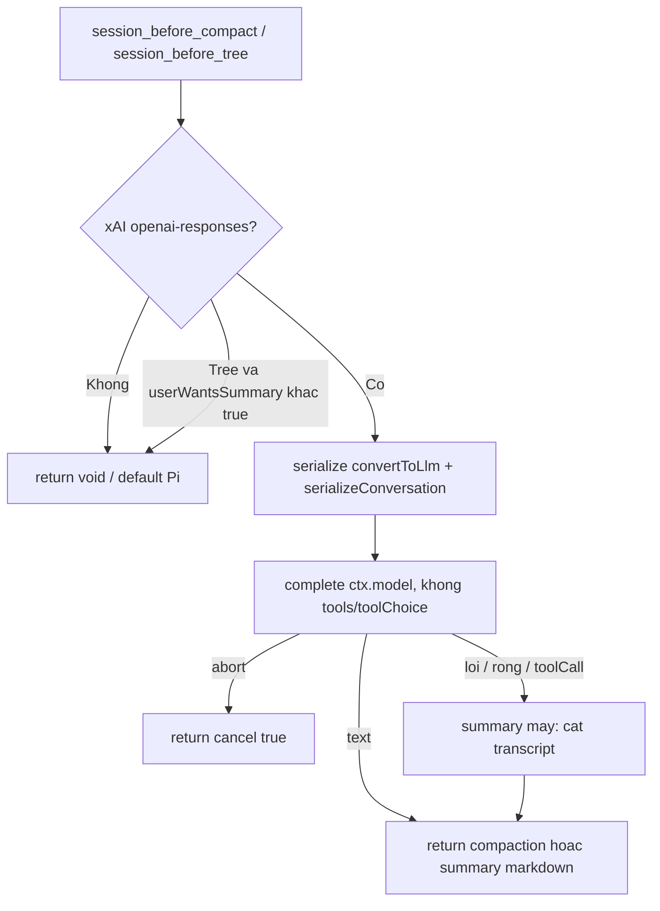
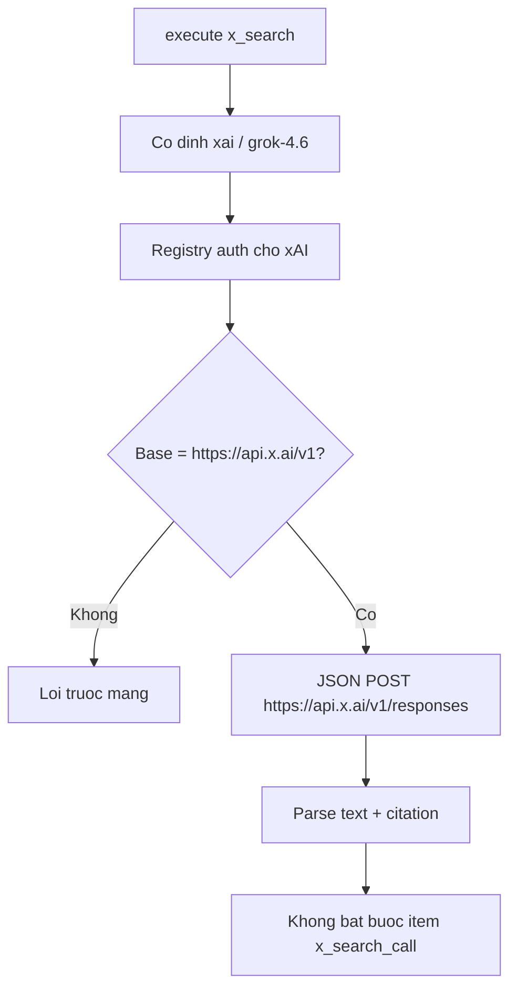

# Architecture

Bản đồ kho và luồng làm việc. Hợp đồng chi tiết nằm ở `README.md`. File này không thay thế spec hay README.

## Cây kho

```text
xAI-pi/
├── AGENTS.md                 # con trỏ cho agent
├── README.md                 # hợp đồng runtime
├── web_search.ts             # tool web_search, dual-backend
├── x_search.ts               # tool x_search, xAI trực tiếp
├── xai-compact.ts            # compact /tree workaround xAI Responses
└── docs/
    ├── ARCHITECTURE.md       # tài liệu này
    ├── web_search.md         # tài liệu vendor Web Search
    ├── x_search.md           # tài liệu vendor X Search
    ├── grok-4.6.md           # ghi chú model (tham khảo)
    ├── Reasoning.md
    ├── Maximizing Cache Hits.md
    ├── What Breaks Caching.md
    ├── Context Compaction.md
    └── plans/active/         # spec và kế hoạch đang mở
```

Ba extension cố ý tách rời. Sửa hoặc xóa một file không được làm file kia hết load.

## Bản đồ tài liệu

| Câu hỏi | Đọc |
|---|---|
| Kho này làm gì? File nào là sản phẩm? | `README.md` |
| Agent nên đọc gì trước khi sửa? | `AGENTS.md` |
| Request đi đâu theo model? | mục Luồng runtime dưới đây |
| Tham số public / timeout / truncation | `README.md` |
| Shape API xAI gốc | `docs/web_search.md`, `docs/x_search.md` |
| Mapping Codex, SSE, lỗi đã chứng minh | `docs/plans/active/web-search-openai-codex-spec.md` |
| Workaround compact Grok (Pi 0.84.3) | `xai-compact.ts` và `docs/plans/active/xai-compact-workaround-spec.md` |
| Việc hiện tại, bằng chứng, rollback | `docs/plans/active/*.md` |
| Ghi chú cache/reasoning Grok | các file `docs/*.md` còn lại — không phải hợp đồng sản phẩm |

Thứ tự ưu tiên khi lệch nhau: code đang chạy → `README.md` → spec trong `docs/plans/active/` → tài liệu vendor → ghi chú tham khảo.

## Luồng làm việc trong kho



Cài vào Pi chỉ khi người dùng yêu cầu:



Rollback `web_search` toàn cục: chép lại `/root/.pi/agent/extensions/web_search.ts.bak` rồi `/reload`. Rollback `xai-compact` toàn cục: xóa `/root/.pi/agent/extensions/xai-compact.ts` rồi `/reload`.

## Luồng runtime `web_search`

Active model lấy từ `ctx.model`. Auth lấy từ `ctx.modelRegistry.getApiKeyAndHeaders(model)`.



Giới hạn chung: timeout 120s, body 2 MiB, tối đa 50 citation. Grok và `x_search` gửi trần 8192 output token; Codex từ chối field đó.

## Luồng runtime `xai-compact`

Chỉ khi `ctx.model.provider === "xai"` và `ctx.model.api === "openai-responses"`.



Không gọi `POST /v1/responses/compact`. Overflow trên xAI không được `return void`.

## Luồng runtime `x_search`

Không phụ thuộc model đang chat.



## Kiểm tra

```sh
node --experimental-strip-types --check web_search.ts
node --experimental-strip-types --check x_search.ts
node --experimental-strip-types --check xai-compact.ts
```

Syntax pass không chứng minh hosted search, citation, hay compact. Live smoke cần auth ngoài kho và đúng model: Grok + `openai-responses`, hoặc `openai-codex`, hoặc `xai/grok-4.6` cho `x_search`. Compact live cần phiên xAI Responses thật và `/compact` hoặc `/tree` summarize.
